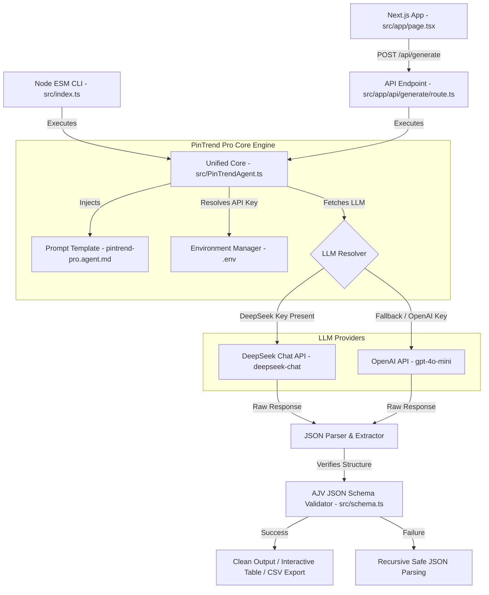

# 🌵 PinTrend Pro Engine — Enterprise Pinterest SEO Agent

[](https://www.typescriptlang.org/)
[](https://nextjs.org/)
[](https://deepseek.com/)
[](LICENSE)

PinTrend Pro is a premium, enterprise-grade Content Intelligence and Pinterest SEO Generation Engine specifically optimized for the **Mexican Home Decor & Artisan Craft Niche**. It leverages advanced LLMs (DeepSeek V3 / OpenAI GPT-4o) combined with a premium, glassmorphic dark interface to generate high-conversion keywords, A/B-tested titles, image generation prompts, and custom blog match indices.

---

## 🏗️ System Architecture

The system is designed with a decoupled architecture supporting both a high-throughput **standalone CLI** and an **interactive Next.js Web Dashboard** powered by a unified LLM core.



---

## ✨ Features

- **🔋 Dual LLM Engine**: Seamlessly switches between the cutting-edge **DeepSeek V3** (`deepseek-chat`) and **OpenAI GPT-4o-mini** depending on your active API keys.
- **🎨 Glassmorphism UI**: A gorgeous cyber-desert dark layout crafted with HSL-tailored colors, glowing neon orange cactus accents, and frosted glass panels.
- **⚙️ Standalone CLI**: A robust typescript console tool to automate keyword generation in CI/CD pipelines.
- **🎯 Dynamic Matching**: Cross-matches generated keyword packages to your existing web catalog and blog URLs with deep relevance justification.
- **🛡️ AJV Validation**: Uses strict JSON schema enforcement via Ajv to guarantee structured metadata.
- **📥 One-Click Export**: Allows bulk downloading of SEO bundles in structured **CSV** and **JSON** formats.

---

## 📂 Directory Layout

```bash
Pin-Trend-Agent/
├── .github/workflows/    # CI/CD Workflows
├── src/
│   ├── app/              # Next.js App Router
│   │   ├── api/          # Serverless Endpoints
│   │   │   └── generate/ # POST /api/generate endpoint
│   │   ├── globals.css   # Earthy premium dark design system
│   │   ├── layout.tsx    # Next.js global layout
│   │   └── page.tsx      # Premium Interactive SPA Dashboard
│   ├── lib/
│   │   └── types.ts      # Core TypeScript interfaces
│   ├── index.ts          # CLI Entrypoint
│   ├── PinTrendAgent.ts  # Core Agent logic
│   └── schema.ts         # Ajv validation schemas
├── pintrend-pro.agent.md # System prompt instructions
├── tsconfig.json         # TypeScript configuration
└── .env                  # Environment Variables (Ignored in Git)
```

---

## 🚀 Getting Started

### Prerequisites

- Node.js >= 18.x
- npm >= 9.x

### 1. Installation

Clone the repository and install all dependencies:

```bash
git clone https://github.com/Ismail-2001/Pin-Trend-Pro-Engine.git
cd Pin-Trend-Pro-Engine
npm install
```

### 2. Configuration

Create your `.env` file in the root directory:

```bash
cp .env.example .env
```

Open `.env` and fill in your API credentials. To use DeepSeek V3 (Recommended), paste your key in `DEEPSEEK_API_KEY`:

```env
# Put your DeepSeek API Key here
DEEPSEEK_API_KEY=sk-your-deepseek-key-here

# Alternatively, to use OpenAI:
# OPENAI_API_KEY=sk-your-openai-key-here
```

---

## 💻 Usage

### Execution Mode A: stand-alone CLI

Run the CLI tool instantly to generate, validate, and print keyword packages:

```bash
npm run cli
```

### Execution Mode B: Interactive Web Dashboard

To launch the dev server with Hot Module Replacement (HMR) active:

```bash
npm run dev
```

Your browser will automatically open, or you can navigate to **`http://localhost:3000`** to interact with the premium dashboard.

---

## 🌐 API Reference

### Generate Keywords

`POST /api/generate`

Generates structured Pinterest SEO metadata package.

#### Request Body
```json
{
  "count": 60,
  "seasonal": 18,
  "evergreen": 24,
  "trending": 18,
  "apiKey": "sk-...",
  "blogUrls": [
    "https://yourblog.com/talavera-decor"
  ]
}
```

#### Response (200 OK)
```json
{
  "keywords": [
    {
      "id": "KW-001",
      "keyword": "Rustic Mexican Kitchen Talavera Decor",
      "type": "evergreen",
      "intent": "High-intent transactional",
      "audience_segment": "Homeowners 30-55",
      "trend_score": 9,
      "competition_level": "medium",
      "estimated_monthly_searches": "50K - 100K",
      "pin_format": "Standard Pin / Video Pin",
      "pin_title_en": "Stunning Talavera Kitchen Ideas to Brighten Your Space",
      "pin_title_es": "Ideas de Cocinas con Talavera para Iluminar tu Espacio",
      "pin_description_en": "Discover how hand-painted Talavera tiles can elevate your rustic Mexican kitchen interior...",
      "pin_description_es": "Descubre cómo los azulejos de Talavera pintados a mano pueden elevar tu cocina rústica mexicana...",
      "image_prompt": "A warm, sunlit rustic Mexican kitchen featuring hand-painted Talavera tiles on the backsplash...",
      "suggested_blog_index": 0,
      "suggested_blog_reason": "Matches the user interest in Talavera tiles.",
      "monetization_angle": "Affiliate links to hand-painted tiles",
      "ab_test_title_en": "10 Ways to Tile Your Kitchen with Talavera Art",
      "content_hook": "Transform plain walls into a living canvas of Mexican history!"
    }
  ]
}
```

---

## 🛡️ Quality Assurance

We maintain code quality using static analysis and automated test suites:

- **Typecheck**: `npm run typecheck`
- **Unit Tests**: `npm run test` (via Jest)
- **Production Build**: `npm run build`

---

## 📄 License

This project is licensed under the MIT License. See [LICENSE](LICENSE) for details.
