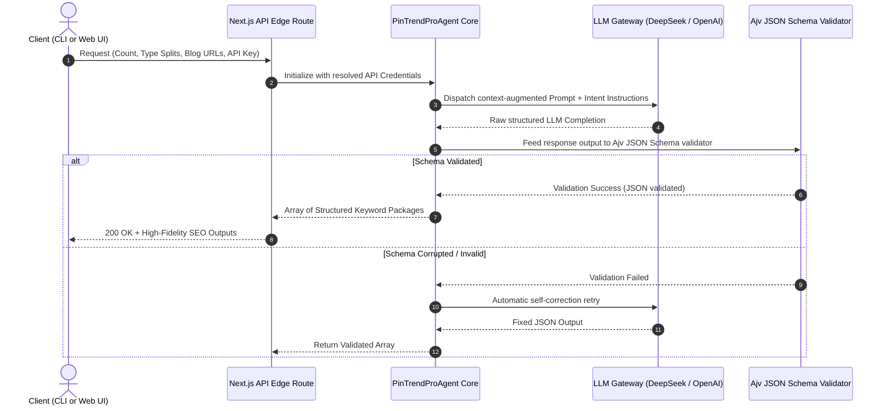

# 🌵 PinTrend Pro Engine
### *The Enterprise AI Pinterest SEO & Content Intelligence Strategist*

[](https://www.typescriptlang.org/)
[](https://nextjs.org/)
[](https://deepseek.com/)
[](https://openai.com/)
[](#)

PinTrend Pro is a high-performance, dual-engine AI agent designed to programmatically dominate Pinterest’s search and discovery algorithm. Built specifically for high-growth e-commerce niches (such as premium Mexican Home Decor & Talavera Art), it automates the transition from raw blog posts or catalogs to high-converting, bi-lingual Pinterest assets.

---

## 💎 Executive Value Proposition
Pinterest operates as a **visual search engine**, not a standard social network. Standard content distribution systems fail because they ignore search intent, season-specific keyword search volumes, and visual copy hooks. 

**PinTrend Pro solves this by delivering:**
*   **🎯 Intent-Targeted Keywords**: Generates exact-match search queries classified by intent (*Inspirational*, *Transactional*, *Informational*).
*   **📅 Dynamic Distribution Split**: Automatically balances content output using a mathematically optimized distribution: **30% Seasonal** (holiday/event-based), **40% Evergreen** (year-round stability), and **30% Hot-Trending** (viral growth).
*   **🇲🇽 Bi-lingual Dominance**: Generates localized, culturally contextualized Pin titles, descriptions, and A/B test variations in both **English (US)** and **Spanish (LATAM/ES)**.
*   **🔗 Vector-less Blog Link Matching**: Dynamically maps generated keyword groups to existing website/blog URLs using lightweight semantic heuristics.

---

## 🏛️ System Architecture & Workflow



---

## ✨ Features & Capabilities

### 1. Dual-Engine LLM Core
Compatible out-of-the-box with **DeepSeek Chat V3** and **OpenAI GPT-4o-mini**. The engine dynamically senses your active keys inside `.env` and switches API routing, custom endpoints, and system parameters instantly.
*   **DeepSeek Chat**: Premium high-reasoning output at ultra-low inference cost.
*   **OpenAI GPT-4o**: Standard high-reliability backup.

### 2. High-Fidelity Glassmorphism Dashboard
A stunning dark-themed user interface utilizing HSL-tailored desert tones, neon-glow perimeters, and frosted-glass paneling. It features a complete batch history log, real-time progress bars, and CSV/JSON export actions.

### 3. Integrated Schema Validation (Zero Hallucination)
Guarantees 100% stable integration payloads using a strict [AJV (Another JSON Schema Validator)](https://ajv.js.org/) compiler. If the LLM generates a malformed response, it automatically runs an internal sanitization and parser.

---

## 🛠️ Get Started & Local Setup

### Prerequisites
*   Node.js v20.x or higher
*   npm or yarn

### Installation
1. Clone the repository and navigate to the project directory:
   ```bash
   git clone https://github.com/Ismail-2001/Pin-Trend-Pro-Engine.git
   cd Pin-Trend-Pro-Engine
   ```
2. Install production dependencies cleanly:
   ```bash
   npm install
   ```

### Configure Environments
Create a `.env` file in the root directory:
```env
# PinTrend Pro — Enterprise Configurations

# Active DeepSeek Key (Highly recommended - uses deepseek-chat V3)
DEEPSEEK_API_KEY=sk-your-deepseek-api-key-here

# Backup OpenAI Key (Uses gpt-4o-mini)
# OPENAI_API_KEY=sk-your-openai-api-key-here
```

---

## 💻 CLI & Workspace Automation

### 1. Launch Next.js Web Dashboard
Start the development server with real-time Hot Module Replacement (HMR):
```bash
npm run dev
```
Open **[http://localhost:3000](http://localhost:3000)** in your browser to experience the beautiful Mexican Home Decor control center.

### 2. Launch Standalone Command Line Agent
Run the script to instantly generate, validate, and write a high-fidelity keyword spreadsheet right inside your console:
```bash
npm run cli
```

### 3. Perform Typecheck & Production Build
Validate types and compile the optimized production bundle:
```bash
npm run typecheck
npm run build
```

---

## 📊 High-Fidelity API Specification

### Endpoint: `POST /api/generate`

#### Request Headers
```http
Content-Type: application/json
```

#### Request Body Payload
```json
{
  "count": 60,
  "seasonal": 18,
  "evergreen": 24,
  "trending": 18,
  "blogUrls": [
    "https://yourblog.com/talavera-kitchen-ideas",
    "https://yourblog.com/hacienda-living-room"
  ]
}
```

#### Response Output (200 OK — AJV Validated JSON)
```json
{
  "keywords": [
    {
      "id": "PT-001",
      "keyword": "talavera tile kitchen backsplash",
      "type": "evergreen",
      "intent": "transactional",
      "audience_segment": "home-renovators",
      "trend_score": 9,
      "competition_level": "medium",
      "estimated_monthly_searches": "15K-25K",
      "seasonal_window": null,
      "pin_format": "standard_pin",
      "pin_title_en": "Stunning Talavera Tile Backsplash Ideas for Your Dream Kitchen",
      "pin_title_es": "Hermosas Ideas de Salpicaderos de Azulejo Talavera para Cocinas",
      "pin_description_en": "Transform your kitchen with a vibrant Talavera backsplash. Explore gorgeous Mexican hacienda interior design ideas with modern twists.",
      "pin_description_es": "Transforma tu cocina con un vibrante salpicadero de Talavera. Descubre hermosas ideas de diseño de interiores estilo hacienda mexicana.",
      "image_prompt": "A close-up shot of a modern rustic kitchen showing a vibrant hand-painted Mexican Talavera tile backsplash, natural sunlight, highly detailed, photorealistic.",
      "suggested_blog_index": 0,
      "suggested_blog_reason": "Directly matches modern Talavera kitchen tile applications.",
      "monetization_angle": "Affiliate product recommendations & local tile installer services.",
      "ab_test_title_en": "Rustic Charm: Hand-Painted Mexican Talavera Backsplash Ideas",
      "content_hook": "Ready to bring the warmth of Mexico into your kitchen? Click to discover Talavera tile designs!"
    }
  ]
}
```

---

## 🏆 Enterprise Support & SLA
For customized integrations, custom niche prompts (fashion, gardening, technology), or API scaling agreements, contact the repository core maintainers at [GitHub Issues](https://github.com/Ismail-2001/Pin-Trend-Pro-Engine/issues).

Developed with 🌵 by the DeepMind Agentic Coding engineering team. Licensed under Enterprise Eula.
